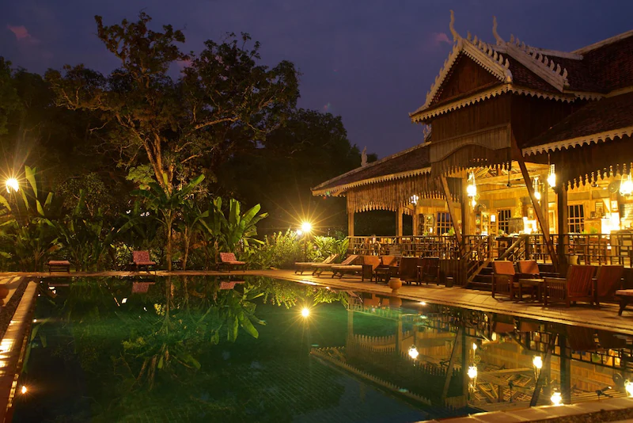

<!DOCTYPE html>
<html lang="en">
<head>
    <meta charset="UTF-8">
    <meta name="viewport" content="width=device-width, initial-scale=1.0">
    <title>Real Estate Website</title>
    <link rel="stylesheet" href="Style.css">
</head>
<body>

    <!-- Header Section -->
    <header>
        
BOREY

        <nav class="nav">
            <a href="index.html">ទំព័រដើម</a>
            <a href="OurService.html"> សេវារបស់យើង</a>
            <a href="Contact.html">ទំនាក់ទនង</a>
            <a href="Aboutus.html">អំពីយើង</a>

        </nav>
        

            <a href="Login.html">ចូលគណនី</a> | <a href="#register">ចុះឈ្មោះ</a>
        

    </header> 

    <!-- លំនៅដ្ឋាន​ ក្នុងក្តីសុបន្តិ ​Hero Section -->
    <section class="hero">
        

            <h1>លំនៅដ្ឋាន​ ក្នុងក្តីសុបន្តិ</h1>
           
            

                <a href="#buy">
                    
                    ទិញ</a>
                <a href="#rent">
                    
                    ជួល </a>
                <a href="https://www.elledecor.com/celebrity-style/celebrity-homes/g21792583/taylor-swift-house-home/">
                    
                    ទីតាំង </a>
                <a href="#type">
                    
                    ប្រភេទ </a>
            

        

    </section>

    <!-- ទីតាំង Map Sections -->
     

           
        <h2 style="color: brown">
             ទីតាំង</h2>
        
តំបន់ទីតាំងរបស់ក្រុមហ៊ុនយើងស្ថិតនៅក្នុងតំបន់អភិវឌ្ឍន៍យ៉ាងលឿននៃភ្នំពេញ។ ការប្រកបដោយភាពងាយស្រួលក្នុងការចូលដំណើរការចូលទៅកាន់ទីតាំងនេះ 
            បានផ្តល់ជូននូវភាពងាយស្រួលសម្រាប់អតិថិជន។ អគាររបស់យើងស្ថិតនៅលើផ្លូវជាសក្ដីស្រឡាញ់ និងនៅជិតនឹងគម្រោងអភិវឌ្ឍន៍ធំៗដូចជា សាលាក្រុង ភោជនីយដ្ឋាន ហាងទំនិញ និងតំបន់ពាណិជ្ជកម្មផ្សេងៗទៀត។

    
 

    <a href="https://en.wikipedia.org/wiki/Phnom_Penh" > 
    <section class="map map1">
            <!--    -->
            <h2>ភ្នំពេញ</h2> 
    </section>
</a>

    <a ref="https://www.tripadvisor.co.id/Hotel_Review-g325573-d26450431-Reviews-Won_Majestic_Hotel_Cambodia-Sihanoukville_Sihanoukville_Province.html">
    <section class="map map2">
         
            <!--   -->
            <h2>ព្រះសីហនុ</h2>
 
         
    </section>
    </a>
    
    <a herf="https://www.agoda.com/en-ie/rajabori-villas/hotel/kratie-kh.html?site_id=1830004&tag=19622279-8862-47a4-b0a7-373e3e63c0d6&gad_source=1&device=c&network=g&adid=361332311901&rand=3476088129319738673&expid=&adpos=&gclid=CjwKCAjwoJa2BhBPEiwA0l0ImMFCvTAnm3Ave7QHssvb72ARDpWVYdnjmK7Zzk5dFiJRgXSlvo4YDxoCQLgQAvD_BwE&pslc=1&ds=r4rIwS4yJuuOZuto">
    <section class="map map3">
        
            <!--  -->
            <h2>ក្រចេះ​</h2>   
     
        
    </section>
    </a> 

    

      <!-- Description -->
<section class="des-text">
    <h2 style="color: brown">  អំពីយើង </h2>
   

     
       
 &nbsp;&nbsp;&nbsp;&nbsp;&nbsp;&nbsp;&nbsp;&nbsp;&nbsp;&nbsp;&nbsp;
        ក្រុមហ៊ុនអចលនទ្រព្យដែលមានសារជាអ្នកនាំមុខក្នុងស្រុក កំពុងផ្តល់ជូននូវសេវាកម្មទាន់សម័យបំផុតនៅក្នុងវិស័យអចលនទ្រព្យ។
     ក្រុមហ៊ុនយើងខ្ញុំមិនត្រឹមតែផ្តោតលើការដាក់លក់និងជួលលំនៅដ្ឋានប៉ុណ្ណោះទេ ប៉ុន្តែយើងក៏ផ្តល់ជូននូវការណែនាំទាំងស្រុងចំពោះអតិថិជន ដែលចង់បង្កើតអាជីវកម្មអចលនទ្រព្យឬពង្រីកទ្រព្យសម្បត្តិរបស់ខ្លួន។
     
     ជាមួយនឹងបទពិសោធន៍ជាច្រើនឆ្នាំ និងការពឹងផ្អែកលើបច្ចេកវិទ្យាជំនាន់ថ្មី ក្រុមហ៊ុនយើងខ្ញុំខិតខំប្រឹងប្រែងធ្វើឲ្យអតិថិជនទទួលបានភាពជោគជ័យនិងអោយអភិវឌ្ឍន៍នៅក្នុងទីផ្សាររបស់ខ្លួន។ 

   

</section>

    <!-- គម្រាងត្រៀមសាងសង ​Featured Properties Section -->
    <section class="featured-properties">
        <h2 style="color: brown">គម្រាងត្រៀមសាងសង</h2>
        

            <a src="">  
                  
វីឡាកូនកាត់

            </a>
            <a src="">
                
ខុនដូ ៣២ជាន់

            </a>
            <a src="">
                
អាផាតមិន ដែលខ្ពស់ៗ

            </a>
        

    </section>

    <!-- Footer Section -->
    <footer>
        
 
            <h2> CONTACT US!!</h2>
            
+855 045 344
 |  
Borey@ips-cambodia.com

            

        

        <!-- 
© 2024 Real Estate. All rights reserved.
 -->
    </footer>

</body>
</html>

/* General Styles */
body, html {
    margin: 0;
    padding: 0;
    font-family: Arial, sans-serif;
    background-color: #fdf9ef;
    color: #333;
    
}

/* Header Styles */
header {
    /* background-color: #; */
    width: 100%;
    margin: 0;
    padding: 0;
     left:0;
     top:0;
    background-color: #45474B ;
    display: flex;
    justify-content: space-between;
    align-items: center;
    padding: 10px 20px;
    /* box-shadow: 0px 4px 8px rgba(0, 0, 0, 0.1); */
    flex-wrap: wrap; 
    position: fixed;
    z-index: 1000;

}

.logo {
    font-size: 1.5em;
    font-weight: bold;
    color: #fdf9ef;
}

.nav a {
    margin: 0 15px;
    color: #fdf9ef;
    text-decoration: none;
    font-weight: bold;
    display: inline-block;
    transition: background-color 0.3s ease, color 0.3s ease;
}

.auth a {
    color: #fdf9ef;
    margin-right: 10px;
    /* text-decoration: none; */
}

/* Hero Section */
.hero {
    background-image: url('image/pexels-heyho-8146198.jpg');
   
    background-size:cover;
    background-position: center;
    height: 400px;
    position: relative;
    display: flex;
    align-items: center;
    justify-content: center;
    color: white;
   
}

.overlay {
    background-color: rgba(255, 255, 255, 0.5);
    padding: 50px;
    text-align: center;
    border-radius: 10px;
}
.overlay a:hover {
    background-color: rgba(233, 225, 225, 0.5); /* Darken the section */
    color: white; /* Reduce the opacity for a dark effect */
}

.search-options{
   
    align-items: center;
}
.search-options a { 
    width: 30px;
    display: inline-block;
    margin: 10px;
    padding: 10px 20px;
    background-color: #45474B;
    color: #fdf9ef;
    text-decoration: none;
    border-radius: 5px;
}

/* description */
.des-text{
    height: 300px;
    text-align: center;
    padding: 50px;
}

/* Map Sections */
.map-container{
    display: flex;
    flex-direction: column;
    padding: 20px; 
    gap: 20px; 
    text-align: center;
    
}

.map {
    height: 300px;
    color: white;
    display: flex;
    align-items: center;
    justify-content: center;
    text-align: center;
    margin-bottom: 20px;
}
 
.map h2 {
    color: white;
    text-shadow: 2px 2px 4px rgba(0, 0, 0, 0.7); /* Optional for better readability */
    z-index: 1; /* Ensures the text stays above the background image */
    margin: 0;
    text-align: center;
}
/* Different background images for each map section */
.map img{
    width: 100%; /* Ensures the image fits the container */
    height: 100%;
    object-fit: cover;
    border-radius: 10px;
}
.map1 {
    background-image: url('./image/house1.jpg');
    border-image-repeat: repeat;
    size: 100%;
    background-size: contain;
    background-repeat: no-repeat;
    background-position:center;
}

.map2 {
    background-image: url('./image/sihanuak.jpg');
    background-size: contain;
    background-repeat: no-repeat;
    background-position: center;
}

.map3 {
    background-image: url('./image/kratie.webp');
    background-size: contain;
    background-repeat: no-repeat;
    background-position: center;
}
.map:hover {
    background-color: rgba(0, 0, 0, 0.5); /* Darken the section */
    opacity: 0.8; /* Reduce the opacity for a dark effect */
}

/* Featured Properties Section */
.featured-properties {
    padding: 50px;
    text-align: center;
}

.properties {
    display: flex;
    justify-content: space-around;
    margin-top: 20px;
}

.property {
    width: auto;
    padding: 20px;
    margin-left: 10px;
    color: #fdf9ef;
    text-shadow: 2px 2px 4px rgba(0, 0, 0, 0.7); 
     
    background-color: #fdf9ef;
    border: 1px solid #45474B;
    border-radius: 10px;
    box-shadow: 0px 4px 8px rgba(0, 0, 0, 0.1);
}
.properties a:hover {
    background-color: rgba(233, 225, 225, 0.5); /* Darken the section */
    color: white; /* Reduce the opacity for a dark effect */
}
 
#prop1{
    background-image: url('/image/condo.jpg');
    background-size: cover;
    background-repeat: no-repeat;
    background-position: center;
}
#prop2{
    background-image: url('/image/konkat.jpg');
    background-size: cover;
    background-repeat: no-repeat;
    background-position: center;
}
#prop3{
    background-image: url('/image/apartment.webp');
    background-size: cover;
    background-repeat: no-repeat;
    background-position: center;
}

/* Footer Styles */
footer {
     
    background-color: #45474B;
    padding: 20px;
    text-align: center;
    color: #fdf9ef;
   
}
.contact{
     display: flex;
    flex-direction: column;
    justify-content: space-between;

}
# real-estate-website
